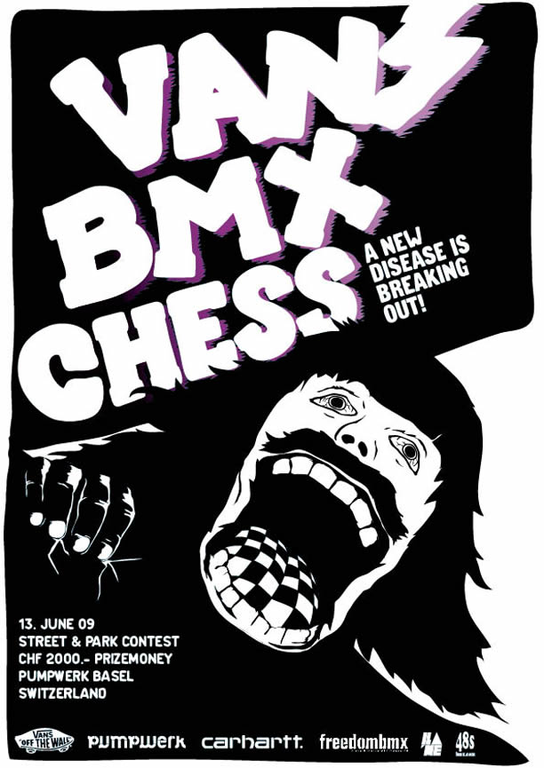

# Vans BMX Chess

<!-- Manuel Hitz -->

On Saturday, 13th June the renovated outdoor skate park „Pumpwerk“ in Basel will be tested for the first time by BMX riders. A one day BMX contest will take place. The CHF 2000.00 price money should attract riders from Switzerland and the surrounding countries to shred the park and to show the “king” trick 09!

For a long time there hasn’t been any “only” BMX contest. That’s why this event in a pool format should offer a new platform for Swiss riders to measure their levels, to support young talents and to meet everybody.

The aim is to have about 50 top riders and rookies from Switzerland, Germany and France.

Two passionate and experienced BMX riders are in charge of the organisation: Hannes Erb from Thun (BE), organisation of BMX shows and judge, as well as Michel Carmona from Riehen (BS), BMX shop owner and manager of the skate park Pumpwerk in Basel.

The outdoor part of the park will be renovated in April and consists of quarters, jumps, spine, mini-ramp, drop and a curved wall ride. In case of bad weather, the contest will be held in the indoor park right beside.

For more information check [www.vans.ch/bmxchess](http://vans.ch/bmxchess/)

## Program

- 11.00 am – 01.00 pm Inscription / practice
- 01.00 pm – 02:30 pm AM contest
- 02:30 pm – 04.30 pm Pro qualification
- 04:30 pm – 05.00 pm Pro finals
- 05:30 pm – 06.00 pm Chess session (best trick)
- 06.00 pm – 06:30 pm Price giving
- 10.00 pm Party

