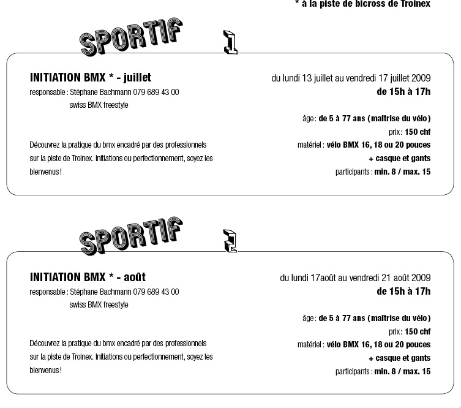

# Inauguration de la piste de BMX de Troinex

Salut les gens !

Pour la petite histoire, notre chère et discrète amie du BMX Line Roby me passe un fil l’autre soir et me dit "Tu sais pas quoi ? Troinex construit une piste de BMX".

Next step, je prends mon petit vélo et fais un tour par là-bas pour découvrir à ma grande suprise une boucle de 150 m. et de 1.5 mètre de large avec quelques simples et triples bosses. Wow ! De quoi agiter le quartier.

Ensuite, je me dis qu’il doit y avoir quelqu’un derrière tout ça et je rappelle Line qui transmet les coordonnées SBF aux employés communaux qui ne manquent pas de nous contacter pour nous inviter "en grande pompes" à l’inauguration du spot.

Jour J, 1 mai. On arrive sur une zone où les gens arrivent petit à petit sans que je flot ne s’arrête. Il faudra environ 100 parents et autant d’enfants pour calmer ce flux impressionnant. Avec Thomas, on rigole en se disant que c’est du jamais vu. Une seule commune rassemble autour d’une mini-piste (genre celle de Balexert) plus d’une centaine de kids ; alors Genève toute entière ???

Ouverture des festivités avec un discours du Maire et de Timothée (à la base de ce projet) qui est le responsable des lieux. Ensuite on me passe le micro et je dit que nous sommes honorés d’être présents. Et c’est vrai ! Être au milieu de toute cette effervescence nous va bien vu notre passé de racers. Qu’ai-je oublié de dire ? Ah oui bien sûr ! La démo rassemble une équipe très spéciale crée il y a plus de 15 ans avec comme acolytes : Fred Borel (Fazon), Thomas Wullschleger (Schleg) et moi-même avec une pièce rapportée "new school" de choix, Yoann Schmid.

Thomas au micro et les autre au guidon s’amusent quelques minutes pour la plus grande joie de tous.

Ensuite, les vignes locales sont honorées avec de rouges et blancs breuvages mais pendant ce temps les enfants ne s’arrêtent pas. Imaginez 100 fous du guidon dans tous les sens, on a eu de la chance de ne devoir soigner personne mais il faudra certes mettre l’accent sur la sécurité pour assurer la pérénité de ce beau projet.

En attendant, nous vous proposons deux camps d’été (voir ci-dessus) pour découvrir ce sport-passion en compagnie de professionnels.

Alors à bientôt, amis du p’ti vélo !

Stéph B

