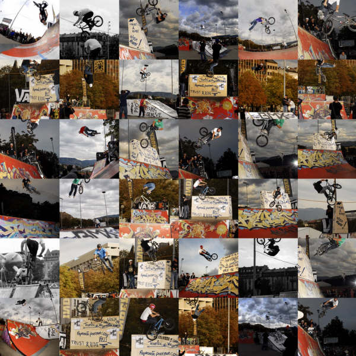

# Swiss BMX Masters De/Engl/Fr

<!-- Stéphane Bachmann -->

## Deutsch

### Swiss Bmx Master 09 Basel und Genf

Swissbmxfreestyle lanciert dieses Jahr zum 1. Mal die Austragung des Swiss Bmx Masters! 

Die Idee ist schon lange in den alten Köpfen einiger Schweizer Bmx Rider. Nun haben wir die Gelegenheit den Swiss Bmx Master zu präsentieren. 

- Round 1 ist das Vans Bmx Chess am 13.6.09 im Skatepark Pumpwerk in Basel. 
- Round 2 ist der Vans BMX Jam am 19.9.09 im Skatepark Plainpalais in Geneve. 

Der Gewinner dieses Cups erhält in Geneve eine coole Überraschung! Es lohnt sich an beiden Events zu starten! 

In die Wertung kommen alle Bmx Rider mit Wohnsitz in der Schweiz oder mit Schweizer Wurzeln. 

Ride On! Und zeig dass Du der 1. Swiss Bmx Master bist! 

_Aber dass geht nicht weil wir können yetzt nicht so gut zuzammen arbeiten ... Schade Liselotte ;-) Auf wieder luege in Genf, BMX Jam._

## English

### Swiss Bmx Master 09 Basel and Geneva

Swiss BMX Freestyle launches this year the Swiss Bmx Masters ! 

The idea turned for a long time in the old heads of a few old Swiss Bmx Riders. This year we have the  great pleasure to present you the only 100% Swiss and BMX event. 

- Round 1 is the Vans Bmx Chess 13.6.09 at Skatepark Pumpwerk in Basel. 
- Round 2 is the Vans BMX Jam 19-20.9.09 at the Skatepark of Plainpalais in Geneva. 

The Winner of this Cup wins a cool surprise in Geneva. It pays out to take part in both Contests! 

To enter the Swiss Bmx Master you have to either live in Switzerland or have Swiss Roots. 

Ride On! And show that you are the 1 Swiss Bmx Master 

_Unfortunately, this will not take place as we didn''t manage a swiss wide collaboration so see you at the BMX Jam ..._ 

## Français

### Swiss Bmx Master 09 Bâle et Genève

Swiss BMX Freestyle lance cette année les Swiss Bmx Masters ! Une première en Suisse ! 

Cette idée qui a trotté dans la tête du Président SBF depuis quelques années prend forme enfin. On peut donc dire que notre pays accueille le premier event 100% Swiss made et 100% BMX avec un certain plaisir. 

- Round 1, la Vans Bmx Chess 13.6.09 au Skatepark Pumpwerk de Bâle. 
- Round 2, la Vans BMX Jam 19-20.9.09 au Skatepark de Plainpalais à Genève. 

Le N°1 des deux events aura un prix surprise qui mérite le déplacement !!! 

Pour concourir pour ce prix, il faut être suisse ou avoir des origines en suisse. 

Ride On et viens road runner pour la coupe des Swiss Bmx Masters 

_Euh, en fait ça va pas le faire car on a pas réussi à communiquer avec nos amis suisse-allemands. On se voit toujours à la Jam ..._

