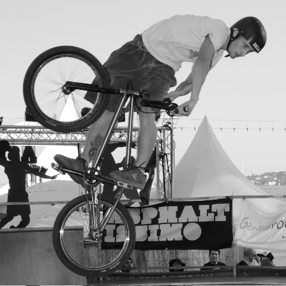
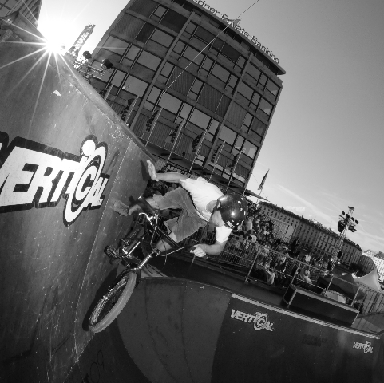
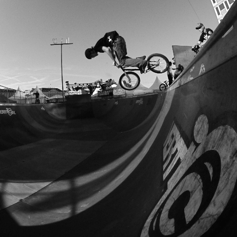
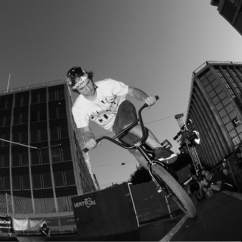

# Asphaltissimo 09 : jeudi 6 août

<!-- Manuel Hitz -->

Photos du plus rapide des photographes : Stéphane Robert-Nicoud

Ça fait bien une demie-heure que je me demande comment débuter cet article sur la première journée BMX d’[Asphaltissimo 09](http://www.asphaltissimo.ch/) que Monsieur Le Président de SBF m’a demandé de rédiger. Je manque d’inspiration. Disons simplement que cette année, pas de [jump box de Hannes](http://www.bmxshow.ch/), pas de démos de flat, juste du bowl à 100%. Le programme convenu pour ce jeudi soir 6 août est une petite compétition, suivie d’une démo par les meilleurs riders sur place.

Le format retenu pour le contest est un B-I-K-E-S. A tour de rôle, chaque rider annonce un trick et a 3 essais pour le rentrer. Ensuite, chaque participant a également 3 essais pour réussir la même figure au même endroit. L’intérêt de ce format est que le public se rend compte (ou peut-être pas?) que chaque rider a son propre style et son propre répertoire de tricks. Chacun tente de dépasser ses limites en s’essayant à des figures nouvelles ou qu’il n’a pas ou plus l’habitude de faire. Et tout ceci en s’amusant! Si un participant ne parvient pas à faire la figure "imposée" en 3 essais, une lettre lui est assignée: d’abord un B, puis un I et ainsi de suite. Autrement dit, chaque rider a 5 vies, puisqu’au bout de la cinquième lettre, lorsque le mot "BIKES" est complet, il est éliminé. Je trouve que ce format révèle aussi un peu la personnalité des riders, suivant le trick qu’ils imposent à leurs potes ;)

C’est parti avec Fred Borel qui, d’entrée, bazarde un No Footed Can-can sur le spine. Pas très fair-play, mais la plupart jouent le jeu. Ce n’est qu’une formalité pour Maxime "Max" Charveron (Lyon), mais Yoann "Yo" Schmid, Mohammed "Moe" Ishuayed et Sébastien Waridel (Yverdon) ont un peu plus de peine. Certains restent raisonnables, ne veulent pas tenter le diable et passent leur tour. Et paf! une lettre dans les dents :)

Moe propose un Foot Jam sur la plate-forme du bowl. C’est un trick plutôt technique, et la majorité arrive à le rentrer en 3 essais.

Vient ensuite Adrien "Clapi" Steinig qui nous signe un sympathique Turndown sur le hip. Bruno Guimil (Yverdon-Sao Paulo), de retour sur son BMX après une longue période creuse due à des problèmes de dos, a besoin de quelques tentatives, mais finit par le plaquer. Je ne vais pas trop m’attarder sur Max, qui réussit tous les tricks avec 2 fois plus de hauteur et 2 fois plus poussés que tout le reste de la troupe. C’est franchement déconcertant. On comprend mieux comment le gaillard finit premier dans des compétitions internationales.

Bruno retourne dans le tech avec un Pedal Grind to 270. Clapi, le "petit joueur", passe son tour "parce que j’ai pas de pegs". Laurent "Koum" Kompaore (Annecy) se bat avec le bowl et sauf erreur, c’est un sans faute pour le reste de l’équipe.

Ensuite, Max exécute un Hand Plant tout propret sur le coping du vert wall. On ne va pas en demander autant aux autres, un Hand Plant tout simple n’importe où sur le vert wall fera l’affaire. On n’est pas des monstres. Fred joue le jeu, c’est limite, mais ça passe. Koum a un peu plus de mal et Moe nous démontre ses talents de tombeur (littéralement).

C’est au tour de Yo qui s’envole en 360 Fakie dans une des courbes du bowl. Une majorité plaque le trick, avec plus ou moins de style et d’aisance. Entre le c-est-ma-première-fois de Clapi, le je-pourrais-facilement-caser-un-barspin-au-milieu de Max et le je-vais-tellement-haut-que-j-ai-le-temps-d-arrêter-ma-rotation-à-mi-chemin de Yo, tout est représenté.

Seb a plus d’un tour dans son sac et il en sort un Tailwhip en courbe. Les newschools n’ont pas trop de problème avec ce trick. Fred check, Moe check, Yo check.

Mickael "Mick" David reste sobre avec un petit Fufanu sur le curb posé sur la plate-forme côté public. La plupart des riders avec frein l’imitent avec succès, tandis que les brakeless passent leur tour et se prennent une lettre.

Le dernier rider en lice n’est autre que Koum. Le doyen de la compétition exige un 540 Tire Tap sur la plate-forme de la rampe. Encore une fois, les riders avec un frein sont avantagés, mais ce sont les règles du jeu.

Après ce premier tour, Mick, Koum et Bruno sont éliminés et ne peuvent donc plus proposer de figures. Le contest s’accélère. Fred lance un Condor sur le spine. C’est un trick difficile, mais beaucoup de riders le rentrent parce qu’il est tendance et qu’il fait plus ou moins partie du répertoire standard de tout BMXer qui se respecte. Donc peu de lettres distribuées cette fois.

Moe décide de ne pas tirer profit des courbes du bowl et, dans le pur style street, lance un 360 Drop dans le plat de la rampe. Yo s’exécute sans problème, ainsi que Max, évidemment.

Clap nous démontre son amour du hip avec un Air bien poussé. Max en remet une couche et tous les autres joyeux lurons en font de même.

C’est au tour de Max de choisir un trick plus sélectif: un 360 Barspin sur le spine. Tellement sélectif d’ailleurs que personne d’autre ne s’y essaie.

Avec une demie-rotation et un Barspin en moins, Yo annonce et exécute un bon gros 180 sur le spine. On assiste à quelques chutes sans gravité (mais dues à la gravité, haha), parce que la réception en Fakie sur cette figure n’est décidément pas évidente.

Seb nous offre une variante du trick de Fred, un Condor en courbe. Plus facile que sur le spine, donc plus de riders le plaquent.

Finalement, en guise de clôture pour ce contest original, Max met le feu au public avec un majestueux Flair. Personne ne fait pareil, si bien que -surprise, surprise- le classement définitif place Max sur la première marche du podium, suivi dans l’ordre par Seb, Clap, Moe, Yo, Fred, Bruno, Koum et Mick.

Plus tard dans la soirée a eu lieu une démo dont j’ai retenu les tricks suivants:

- Max: Pocket Air Barspin et le même en whip
- Mick: Fufanu sur la barrière
- Malek: 360 Nosedive (limite barrel roll tête en bas) en sortie du bowl, après une prise de vitesse chemise au vent
- Moe: 360 sur le spine
- Max: tricot un peu partout

Voilà. Perso, le spectacle m’a bien plu et j’espère que dans un futur article [Alex Pittet](http://www.myspace.com/genevalexphotography) va illustrer mes propos quelque peu abstraits pour les lecteurs non avisés avec une [diapo](http://www.youtube.com/user/alexoubien) comme il sait bien les faire. Stay tuned!

PS: merci à la Ville de Genève, [Vans](http://www.vans.ch/), [Alias One](http://www.alias-one.com/) et [Fairtilizer](http://www.fairtilizer.com/) pour les sous et les lots.

