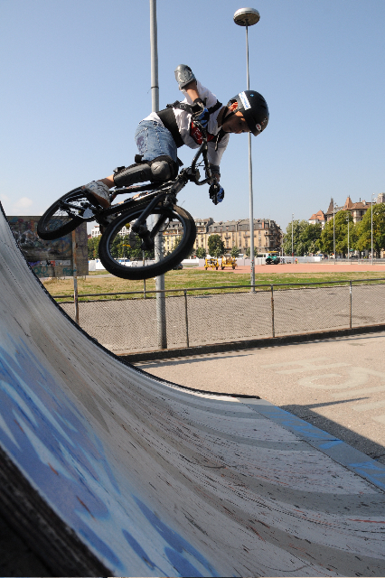
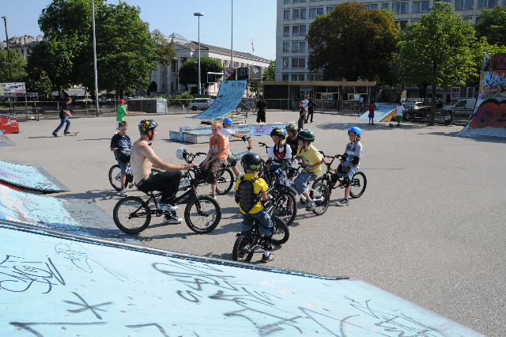
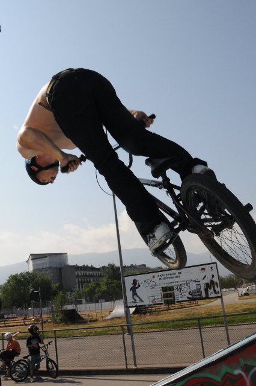
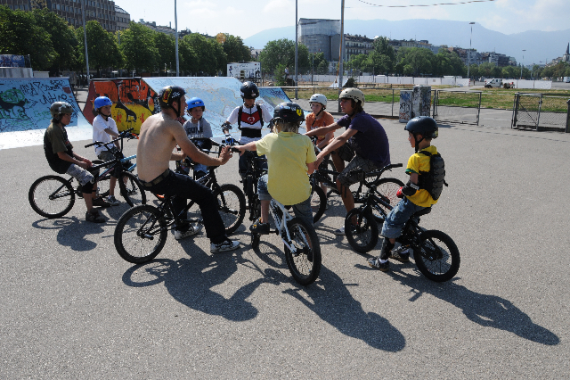
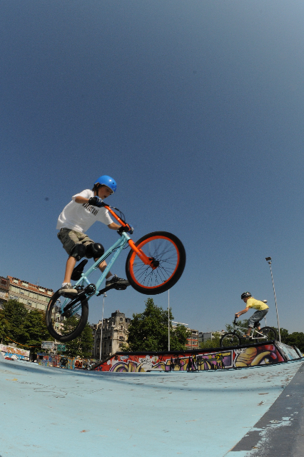
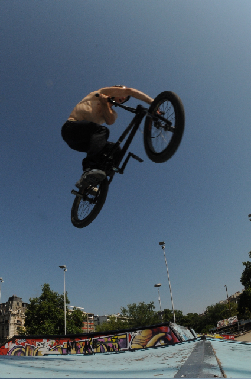
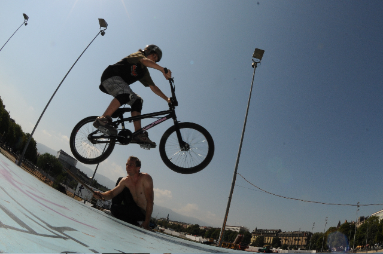
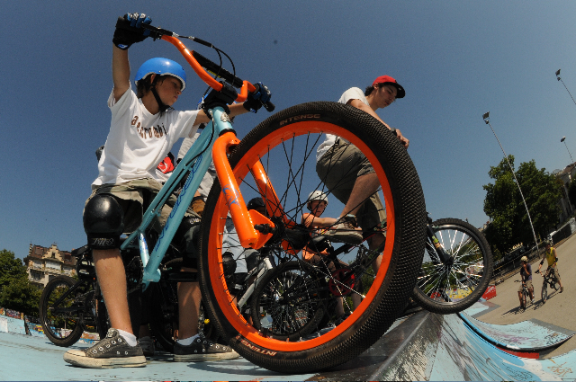

# BMX Summer Camps / juillet 09

Ah les enfants ! Que de passion chez cette jeunesse. Je ne vous dis pas.

Pas peur pour des jeunes on dira. Quand il faut dropper d’une plateforme un peu haute ou même se lancer dans les airs avec un vélo pas toujours au top, ils répondent présent. Blindés d’enthousiasme et d’intérêt, nos 8 rookies de la session ont pu accumuler un petit paquet d’adrénaline tout au long de cette semaine de BMX au skate park de Plainpalais. Merci aux parents pour leur patience et aux enfants pour leur fougue ...

Ci-dessous, 2-3 photos des émotions réunies au cour de la semaine par Stéphane Robert-Nicoud.

En fait, on se voit pour la session finale le 21 août à 10 heures du matin pour concourrir les uns contre les autres ! Les deux camps vont se réunir selon les possibilités de chacun afin de ramener des lots à la maison ;-)

