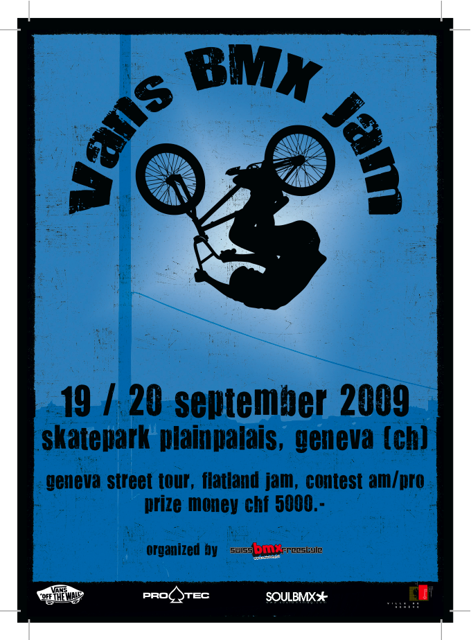
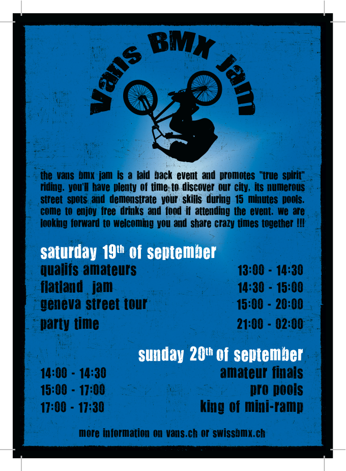

# Vans BMX Jam 2009

<!-- Manuel Hitz -->

## L’événement

La BMX Jam a lieu chaque année depuis 2001 sur le Skatepark de Plainpalais situé au cœur de Genève. Ce spot a acquis une grande réputation de la part de tous les riders BMX.

Avec un total de 80 participants, un public de passage estimé à 2’500 personnes, La BMX Jam attire l’attention du public, de nos autorités ainsi que de nos médias et est reconnue comme la vitrine du BMX en Suisse.

C’est l’occasion  pour les médias et la Ville de prouver leur intérêt pour les sports dits “urbains“ et mettre l’accent sur la promotion d’une activité sportive orienté vers le développement personnel et non la compétition au détriment de la santé.

Nous comptons vous offrir le plus beau des spectacles tout en vous montrant l’essence même de notre sport qui est en pleine évolution après des années difficiles. Rappelons que ce sport est à l’origine du VTT, du FMX et de bien d’autres disciplines alternatives très en vogue aujourd’hui et que notre intention est de pérenniser et promouvoir cette culture.

## L’Esprit BMX JAM

L’esprit de la BMX Jam est des plus relax. Le concept de pools (manches de 15 min. à trois) laisse aux riders le temps de se mettre dans l’ambiance et de donner le meilleur d’eux-mêmes. Nous nous réunissons pour partager un moment de vie agréable et vivre notre passion.

## Les médias

Notre association propose aux médias des vidéos et images pour couvrir l’événement grâce aux photographes et vidéastes locaux ou à leurs propres journalistes. Nous avons aussi notre propre couverture médiatique par le biais du site www.swissbmx.ch.

## Le déroulement

Samedi 19 septembre :

- Inscriptions: 12:00  -  13:00
- Qualifs amateurs: 13:00  -  14:30
- Flatland Jam: 14:30  -  15:00
- Geneva Street Tour: 15:00  -  20:00
- Party Time: 21:00  -  02:00

Dimanche 20 septembre :

- Inscriptions: 12:00  -  13:00
- Finale Amateurs: 14:00  -  14:30
- Pools Pros: 15:00  -  17:00
- King of Mini-ramp: 17:00  -  17:30
- Crazzzy contest: 17:30  -  18:15
- Remise des prix: 18:45  -  19:00
