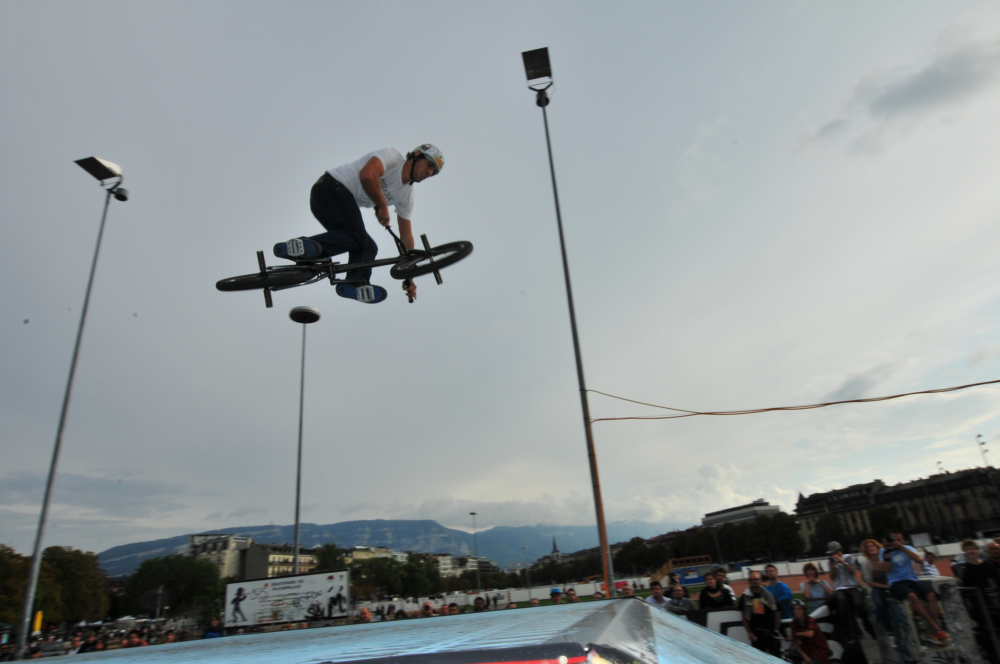
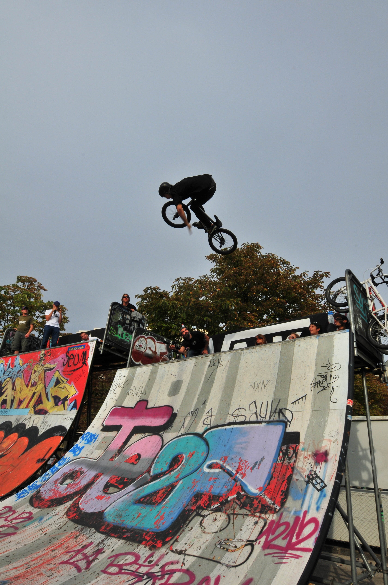
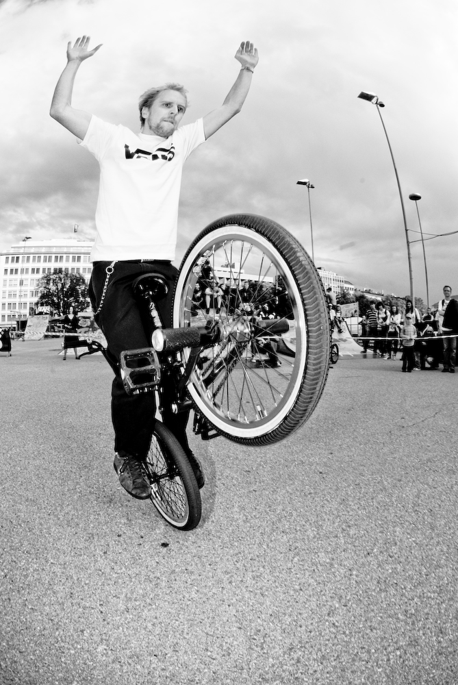
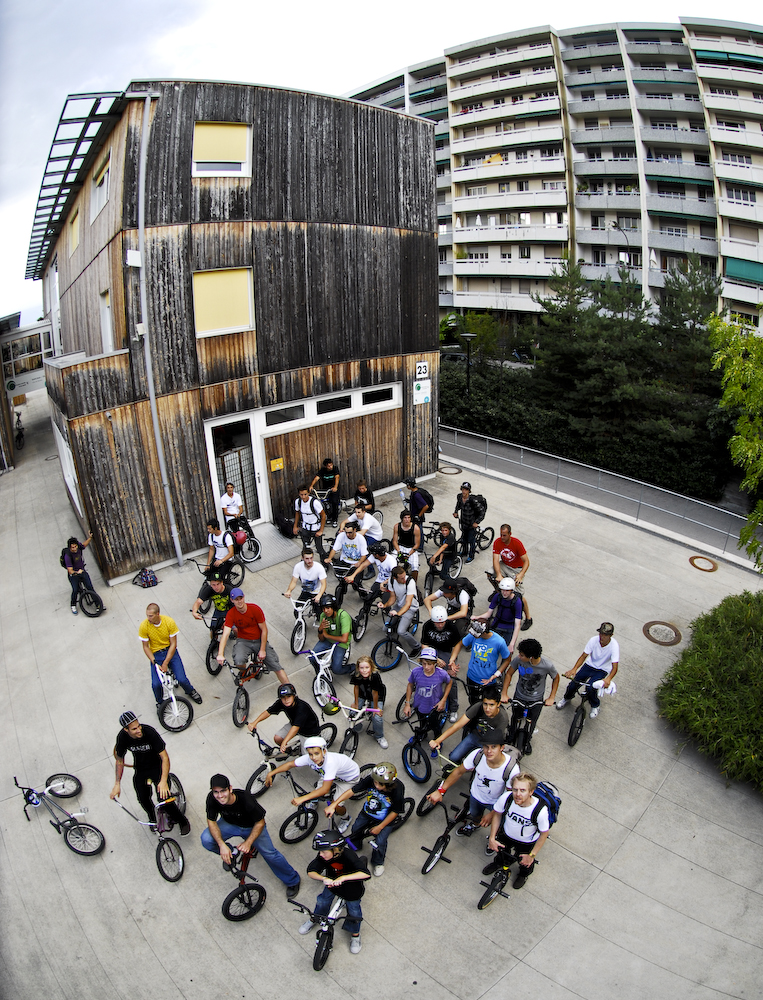
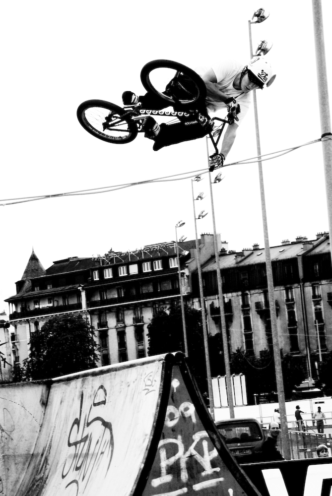

# On a eu chaud !

[Vans BMX Jam by soulbmxmag.com](http://soulbmxmag.com/soul/14.Videos_soul/2009/09/28/2185?BMXINFOSID=d5d554b26e0494832406218af8490698)

Mes aïeux ! La radio, la télé, les sites internets etc ont tous voulu nous décourager mais non ! Rien n’y fait. Pas plus tenace que cette clique de riders à petites roues surnommée SBF dans la région. D’accord, les médias ont annoncé la pluie et ensuite ? La vérité ? Notre Vodoo master a bien fait le job en nous ramenant un temps estival pour cette huitième édition de la BMX Jam. Des tas d’inscrits, de boissons, de publique et de son pour un week-end atypique même dans le milieu. Il ne manquait que la caïpirinha pour faire de cette jam une idylle.

Même qu’il parait que le flat a fait son comeback dans l’event (merci Steven) et que d’autres activités n’avaient jamais eu lieu. De quoi je parle ? Vous lisez pas les journaux ? Le street tour qui a marqué une foule d’esprits et déçu personne sinon le royal téton géant de Madame Champel. Le concept était simple. Réunissez un crew de 70 (septante) riders et emmenez-les pour une sortie en ville avec deux pions rouges (un devant et un derrière). Faites des pauses là où le terrain offre 2-3 perspectives à ceux qui ont un petit vélo dan la tête et zou ! On repart. Une fois le tour quasi terminé, contactez votre Vodoo master le plus proche pour qu’il fasse venir la pluie. De cette manière les "Jean veuxencoredeladiscipline" reviendront l’année suivante pour la suite des festivités ;-) Phots à l’appui plus bas ...

Ensuite, reste à contenter les riders de parc en leur mettant mille canette de votre boisson la plus tauresque (red bull) et équiper le staff de waffles (Vans) et le tour est joué. En passant un par un devant le trio de juges (Haa, Fazon et Quineditmotmaisencode aka shawn snake), les riders ardents reçoivent une dénomination numéraire et on les fait se placer devant de grands logos pour la photo finish. Ah oui, j’allais oublier le coup de quiseraleplusfoudanslamini. Et là vous leur sortez un vélo d’outre-tombe tout droit venu de "Joe Kid on a Stingray". Si après ça vous n’avez toujours pas saisi la recette de la "Vans BMX Jam 2009", je vous laisse m’appeler. Non sans déc !

Merci pour votre temps et n’hésitez pas à contacter la presse pour leur rappeler de couvrir le tournoi de pétanque de votre quartier ce we, ils risquent de manquer un truc géant (je me comprends ...) Merci aussi à tous ceux/celles qui ont participé à l’event d’une manière ou d’une autre. La DéJ pour leur éternel soutien, Vans et Red Bull pour le sponsoring et Soul BMX Mag pour le coverage.

See you around guys !

P.S. : Pour une texte plus classique, achetez le SOUL BMX Mag et pour des images animées, passez plus tard et soutenez Had pendant qu’il fait turbiner son poste de montage. Courage Had ! Et pour un diaporama croustillant de l’ami Alex Pittet cliquez [ici](http://www.youtube.com/watch?v=BUXgHHHek-4)

## Classement Vans BMX Jam 2009

Street Pros :

1. Georgy Doremus
1. Serginho Santana
1. Timur Khra Dshajew
1. Mathias Augris
1. Mohamed Ishuayed
1. Adrien Steinig
1. Benjamin Gilbert
1. Malek Youssef
1. Janick Wenger
1. Anthony Perrin
1. Thomas Benedetti
1. Adrien Sabatier
1. Mathieu Birraux
1. Albert Santos
1. Laurent Kompaoré
1. Raphaël Brüschweiler
1. Dani Herzig
1. Cédric Mito

Street Amateurs :

1. Arnaud Wolf
1. Renaud Blanc
1. Florian Wolf
1. Marcel Wacker
1. Alex Pittet
1. Damien Hussy
1. Thomas Bolciolu
1. Markus Bientenholz
1. Maxime Charletty
1. Didié Von Jill

Street Tour :

1. Georgy Doremus
1. Mohamed Ishuayed
1. Malek Youssef
1. Yoann Schmid
1. Anthony Perrin

King Of the Miniramp :

1. Georgy Doremus
1. Mathias Augris
1. Serginho Santana
1. Janick Wenger

Photos par Alex Pittet et Stéphane Robert-Nicoud

