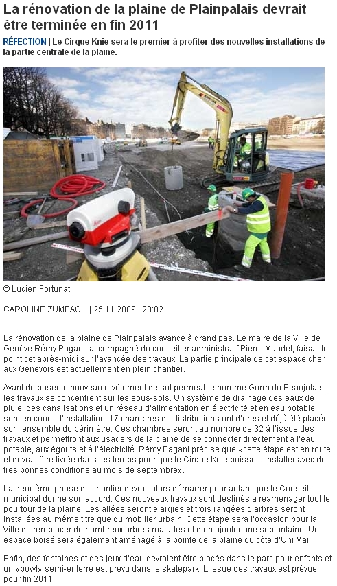

# Rumeurs...

Un [article](http://www.tdg.ch/geneve/actu/renovation-plaine-plainpalais-devrait-terminee-fin-2011-2009-11-25) au sujet de l’éternelle discussion autour de la rénovation du skatepark de Plainpalais (Genève): 

> Enfin, des fontaines et des jeux d’eau devraient être placés dans le parc pour enfants et **un «bowl» semi-enterré est prévu dans le skatepark**. L’issue des travaux est prévue pour fin 2011.

On en a entendu d’autres. J’aime bien l’expression "bowl semi-enterré". La journaliste n’a probablement aucune idée de quoi il s’agit et a dû reprendre mot à mot les termes utilisés par sa source, qui ne doit pas en savoir plus. Pourquoi ne nous consulte-t-on pas?

