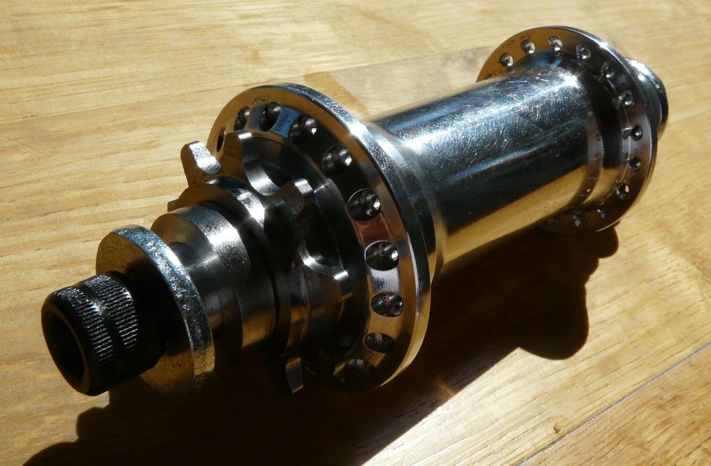
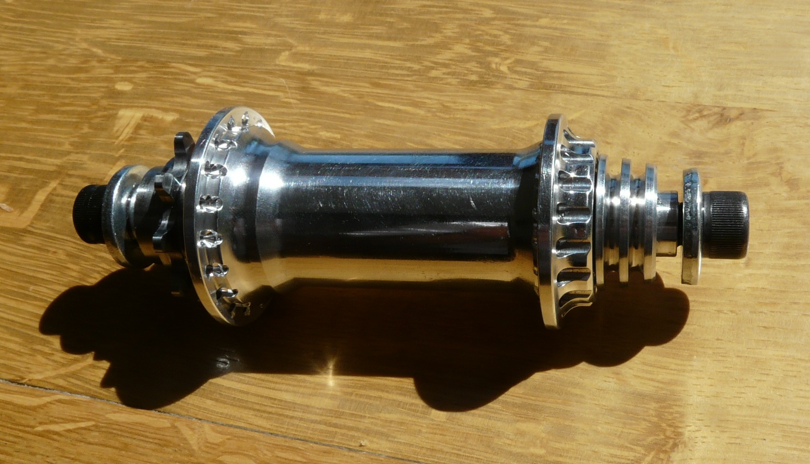
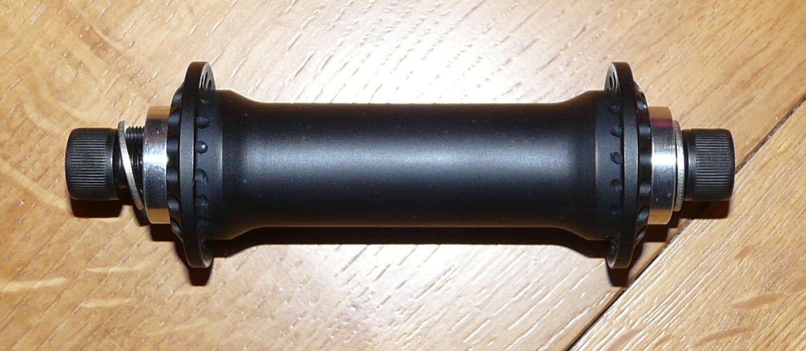
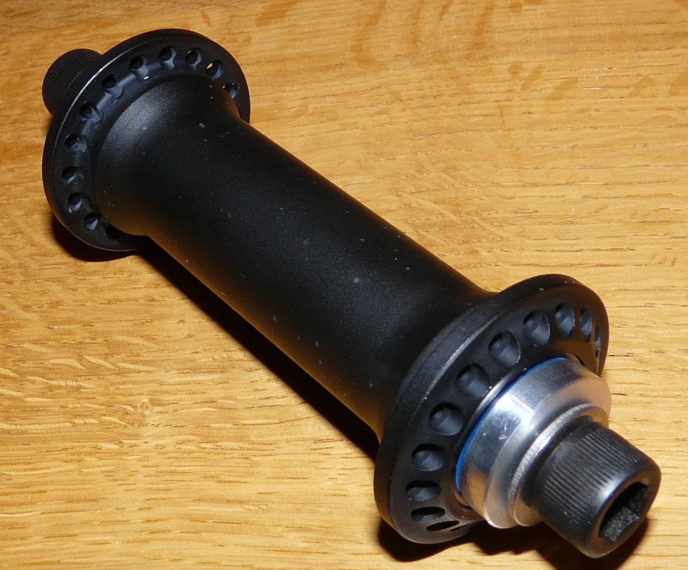

# Made in Damien

<!-- Manuel Hitz -->

La petite scène genevoise a la chance de compter parmi ses adeptes un futur ingénieur mécanicien de talent. Ses créations méritent largement un article sur ce site. Ce sont des moyeux parmi les plus légers du marché, rien que ça! Si tu es intéressé par ses pièces, contacte-nous et nous transmettrons. Damien a lui-même testé le matériel pendant des mois (un petit aperçu à la minute 02:00 par [ici](http://soulbmxmag.com/soul/14.Videos_soul/2009/11/27/2454)), et si on sait que Moe et Clapi (entre autres) sont parmi ses clients, on peut faire confiance. Voici ce que Damien en dit:

## Moyeu arrière

- flanges super espacées » max d’angle pour les rayons » résistance supérieure à la flexion de la jante
- système de cassette montée sur bague en bronze » pas de roulement à casser 
- pas de contre-écrou vissé » 10sec pour le démonter entièrement
- aucune précontrainte sur les roulements » rotation de roue parfaite
- 3 cliquets + 3 ressorts à lame indépendants
- corps en alu EN 7075 aéronautique
- 3 types d’axes disponibles:
  - femelle 17mm alu 7075 + vis 10mm trempée très haute résistance (12.9 pour les connaisseurs) » pour trail rider, park rider et street rider smooth
  - femelle acier trempé + vis 12mm trempée très haute résistance (12.9 pour les connaisseurs) » park et street rider
  - axe acier classique 14mm trempé pour vous qui aimez casser des murets et des pegs
- dispo en 8, 9 et 10 dents
- système anti-rotation de l’axe » montage/démontage simplifié » aucune crainte de devoir desserrer un peu un côté, puis un peu l’autre, puis de nouveu le 1er etc etc...
- flange ultra small (50 et 46mm) très joli, très solide
- hub guard intégré en option
- couleur custom
- poids: 345g complet pour le modèle axe femelle alu + driver 8t

## Moyeu avant

- flanges super espacées » max d’angle pour les rayons » résistance supérieure à la flexion de la jante
- 4 roulements
- axe femelle 15mm en alu EN 7075 aéronautique + vis 10mm trempée très haute résistance (12.9 pour les connaisseurs)
- système anti-rotation de l’axe » montage/démontage simplifié » aucune crainte de devoir desserrer un peu un côté, puis un peu l’autre, puis de nouveu le 1er etc etc...
- flange ultra small (40mm) très joli, très solide, même diamètre que les pegs » pas de gros coups de muret dans les joues
- couleur custom
- poids: 179g complet

Les couleurs sont obtenues par éloxage/anodisation. Pas de peinture!

De la bombe.

**EDIT:** Damien m’a demandé d’ajouter les précisions suivantes.

- les pièces sont fabriquées en série très limitée
- il utilise les moyens personnellement depuis 5 mois
- une version v2 est en test (et remplacera sûrement très bientôt la v1), avec à la place du palier en bronze (à l’arriere) un palier acier trempé-polymère
- la matière utilisée est d’origine européenne (Autriche)
- le moyeu arrière est dispo en LHD et en RHD
- les moyeux sont 100% swiss made et ajustés un par un. Ainsi, toute commande entraîne une attente de minimum 2 semaines (au moins un weekend!), voire plus si l’axe souhaité est en acier (le traitement thermique exige plus de temps)
- pour les ultra street trashers, l’axe 14mm acier est dispo pour l’avant aussi
