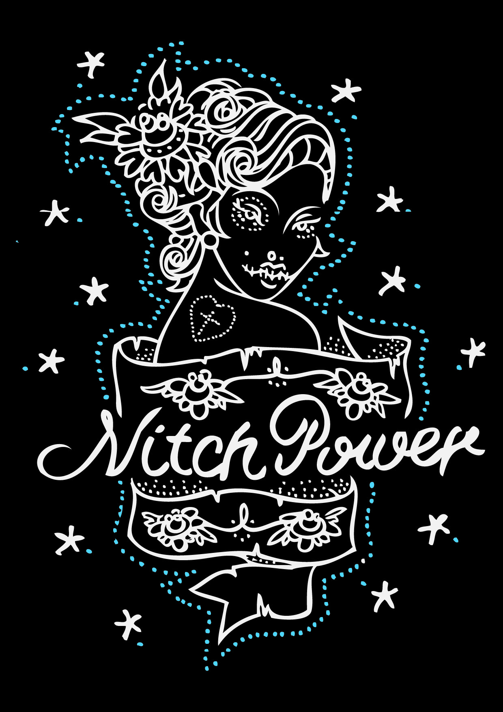

# Nitchpower, ils sont frais du four ...

De la prod de chez Fred Borel dit Fazan bien fraîche.

Et nos amis de SOUL qui disent :

> Le fantastique suisse Fred Borel vient de nous prévenir qu’il sortait une nouvelle marque de tshirt : [Nitchpower](http://nitchpower.blog4ever.com/), un titre évocateur pour ceux qui le connaissent  et pour les autres, bah soyez curieux et découvrez tout l’esprit de ce sympathique artisan sur le blog de Nitchpower. (un des sublimes et sexy logo dans la suite). Sachez que Fred et sa machine à sérigraphier sortiront plusieurs collections par trimestre afin de varier un max et de ne faire que des séries limitées collectors. Attendez vous à du lourd !
> 
> Et qui dit Fred Borel, dit [trust and ride](http://trustandride.tty11.com/), la marque de tshirt orientée trail qui nous a fait rêver à Gréoux lors de la défunte trail people jam, rappelez vous cette projection vidéo sur un drap qui prit feu et laissa place à un groupe de musique, mythique. On vous propose de revoir cette vidéo de Fred, Blackjack, Vince primel et Godasse notamment, c’est du collector. On vous invite aussi à aller sur [la chaine youtube de la marque](http://www.youtube.com/user/nitchbmx) pour d’autres vidéos chez Elian, et au trail éphémère de Valensole (RIP). C’est étonnant que peu de gens aient vu ces vidéos, car ce sont des beaux témoignages d’une époque magistrale, on vous les recommande chaudement. Faites péter les stats de youtube, qu’on passe de 165 vues à au moins 2000 !

C’est pas beau ça ?

Et une pensée à Thomas avec ça ...
