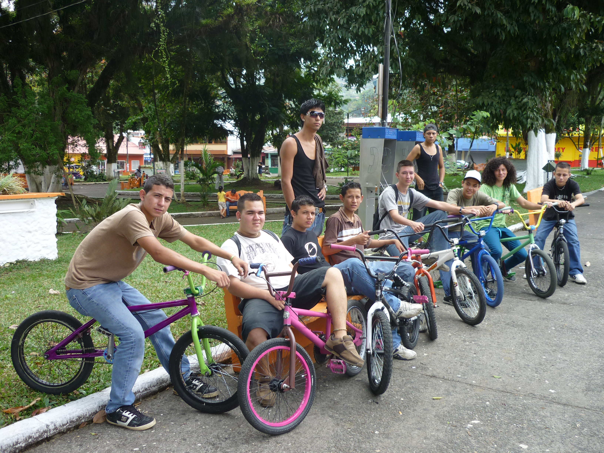
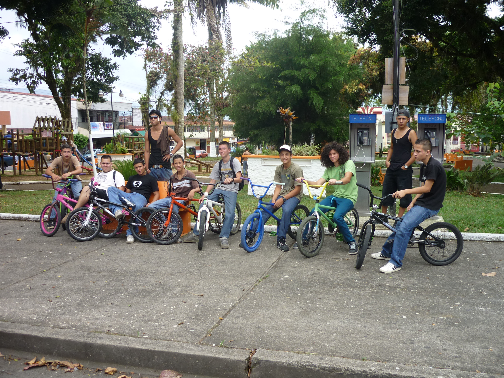
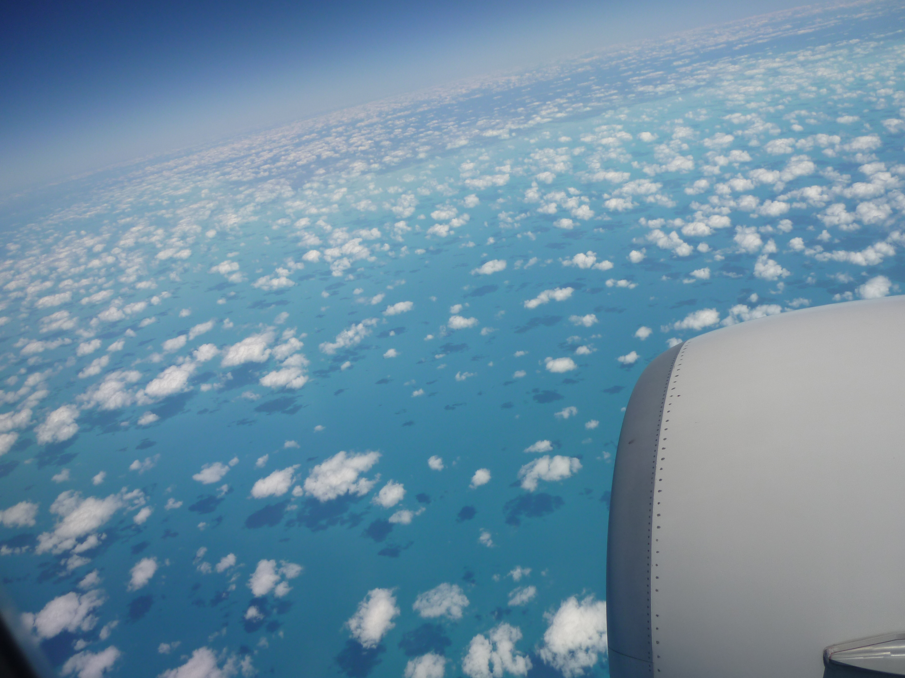
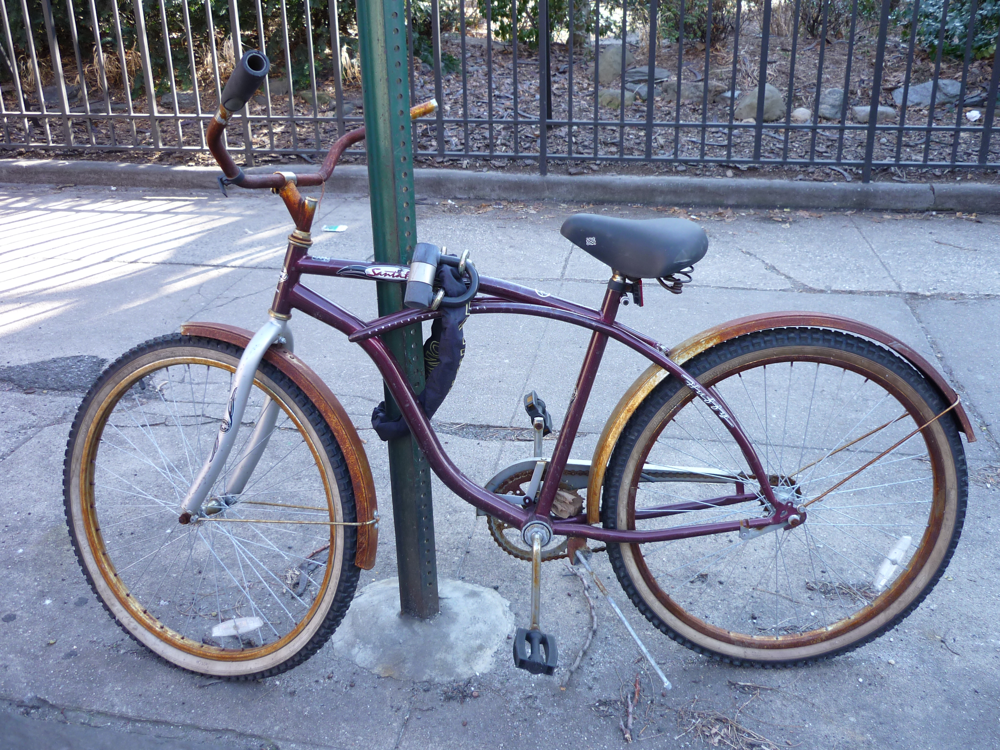

# BMX Crew Turrialba

<!-- Stéphane Bachmann -->

Le Costa Rica étant communément appelé la Suisse d’Amérique Centrale voici deux photos de nos cousins ticos dans la ville de Turrialba. Je m’suis dit "Y’a pas que chez nous que ça pimp du vélo." Je vous laisse apprécier par vous-même le style énervé des riders d’outre-mer.

et encore une couche pour les amateurs de vieilles carlingues

