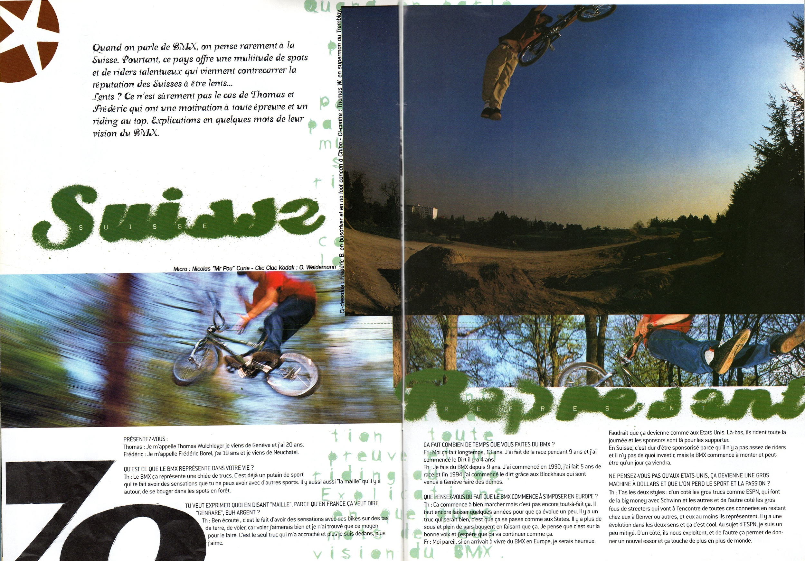
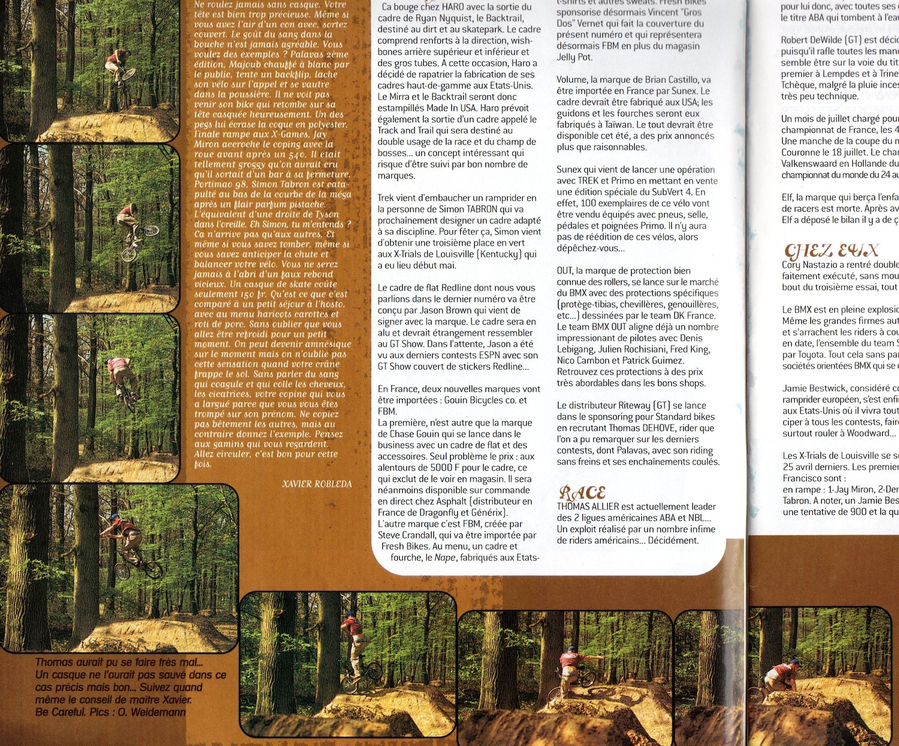

# Soul BMX Experience #4

<!-- Manuel Hitz -->

Je continue à trouver des trucs dans mes archives. Ça m’amuse beaucoup de puiser dans le passé de la scène suisse. Cette fois, ce sera un article de 4 pages sur la "Swiss Dirt Connection" comme il est écrit sur la couverture du Soul #4 paru en juin 1999.

...et en bonus, Thomas qui fait une rencontre inopinée avec un arbre ...sur la page des news du même magazine.

