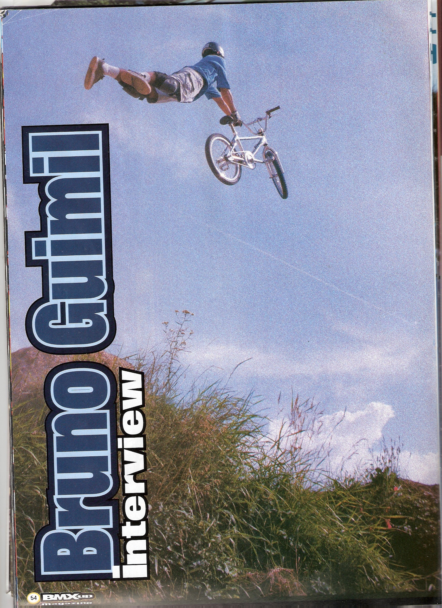
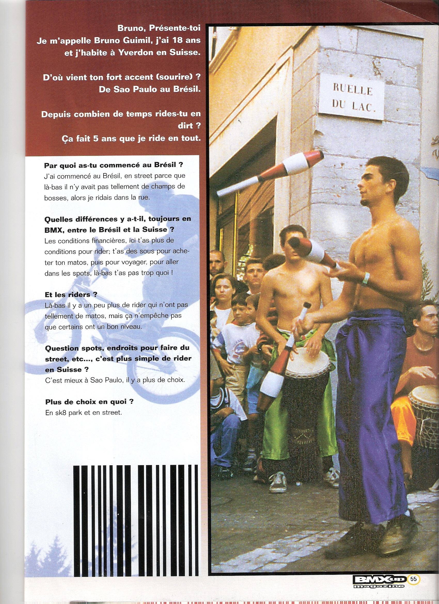
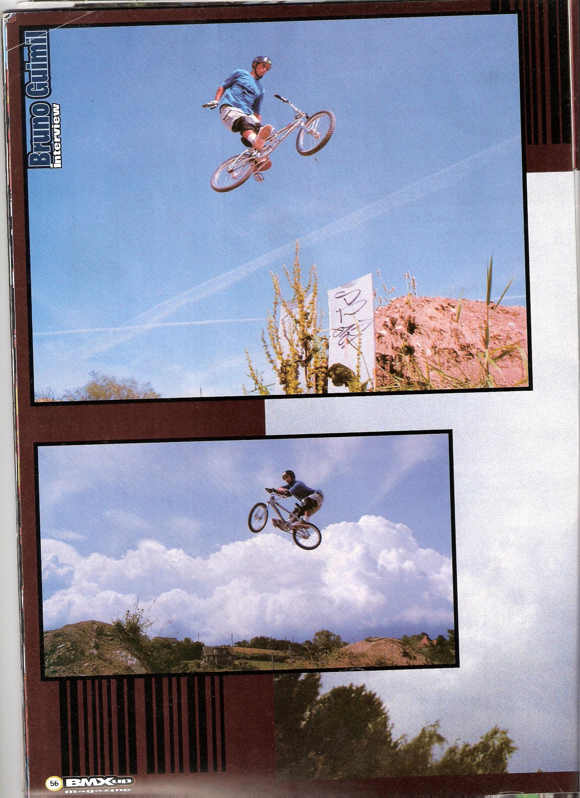
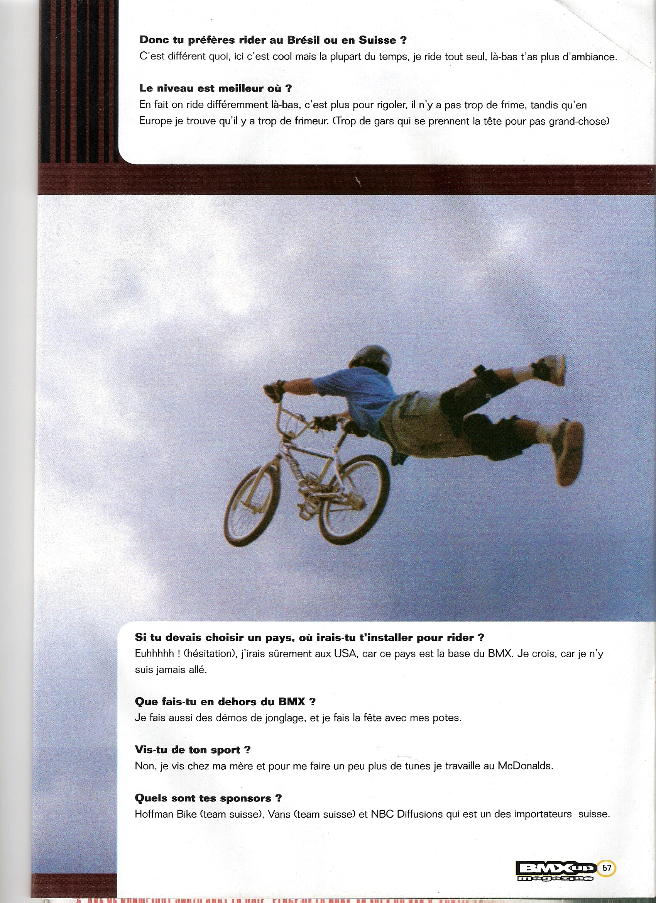

# BMX-up juillet-août 1999

<!-- Manuel Hitz -->

Damien P. a trouvé une interview dans BMX-up d’un rider qui évoluait (évolue encore?) en Suisse, j’ai nommé Bruno Guimil!

Précédemment: archive de l’interview de [Thomas Wullschleger & Fred Borel](./2010-03-22.md)
