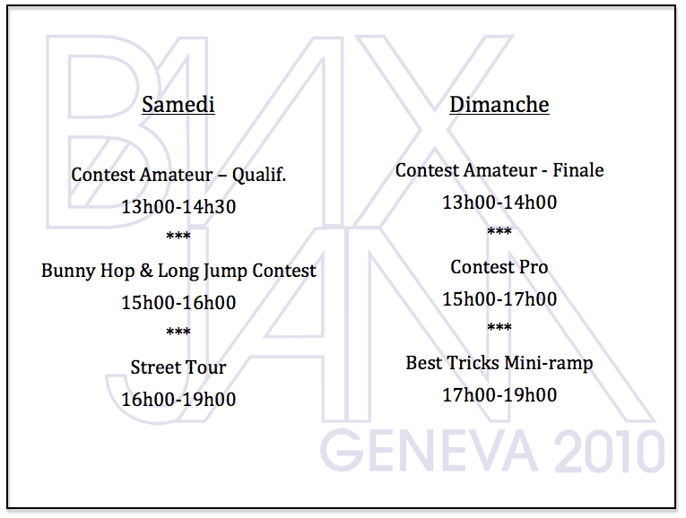

# Genève BMX Jam 2010

<!-- Manuel Hitz -->

Venez nombreux pour la dernière BMX Jam dans le park actuel de Plainpalais. Le mois prochain il sera détruit. Mais il sera remplacé par un park en béton avec une partie street et un partie bowl pour 2012.

Pour ceux qui ne connaissent pas notre Jam, ou ceux qui veulent se remémorer les Jams passées, regardez ces liens: [2009](http://www.youtube.com/watch?v=tBDWlxQ1l5s), [2008](http://www.youtube.com/watch?v=olfGRnMTet0), [2007](http://www.youtube.com/watch?v=Si5B7nOSa5M), [2006](http://www.youtube.com/watch?v=NFGRWmpuPNk) et [2005](http://www.youtube.com/watch?v=zoKEtwUpaW0)

* * *

Join us all for the very last BMX Jam at the current Geneva skatepark. The park is going to be destroyed next month. It will however be replaced by a new cement park by 2012, with a street plaza and a bowl.

For those of you who don’t know anything about our Jam, or those who want to freshen up their memories, go check out the following videos: [2009](http://www.youtube.com/watch?v=tBDWlxQ1l5s), [2008](http://www.youtube.com/watch?v=olfGRnMTet0), [2007](http://www.youtube.com/watch?v=Si5B7nOSa5M), [2006](http://www.youtube.com/watch?v=NFGRWmpuPNk) and [2005](http://www.youtube.com/watch?v=zoKEtwUpaW0)

