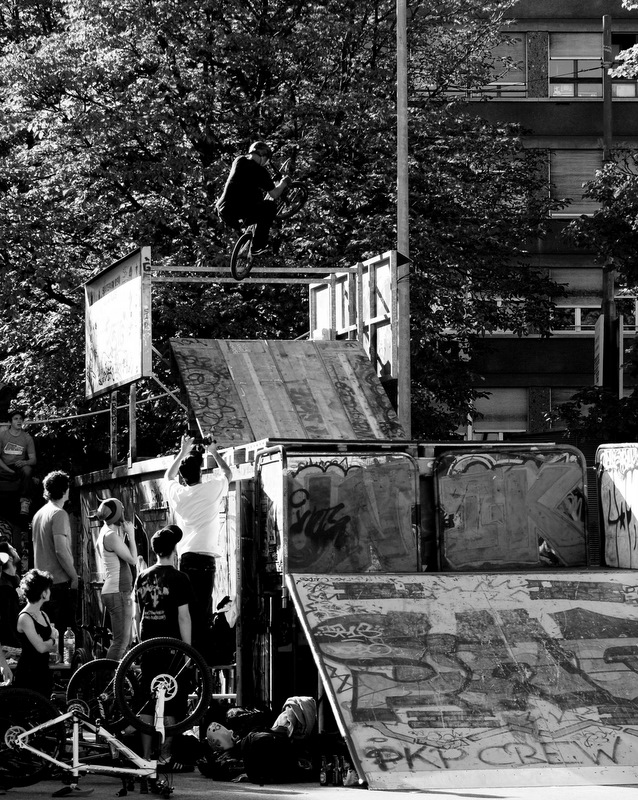
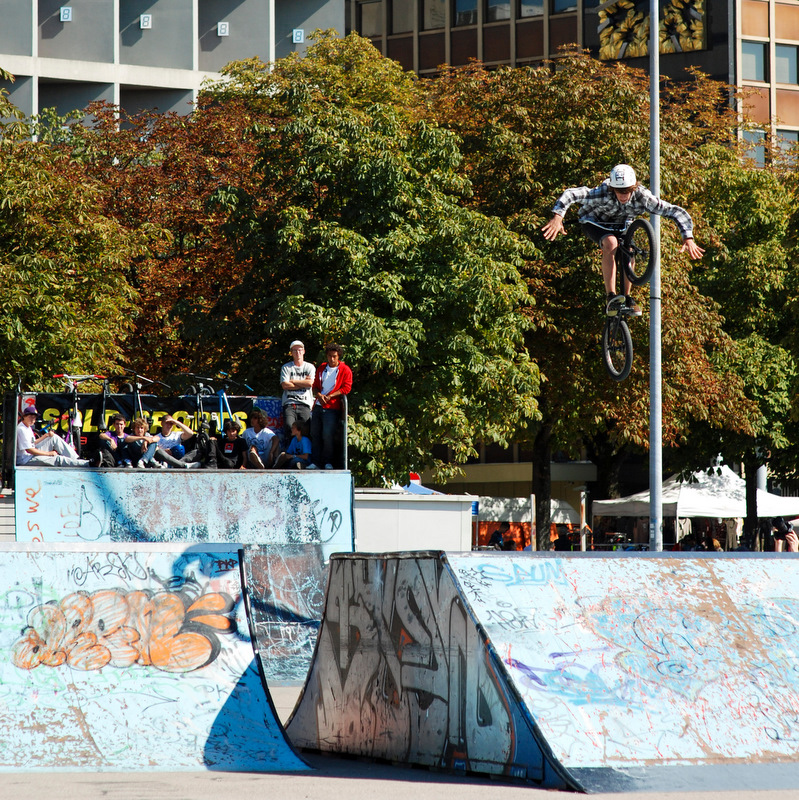

# BMX Jam 2010 en images

Le top 8 des 23 pros inscrits:

1. Thomas Benedetti
1. Anthony Perrin
1. Serginho Sant’ana & Moe Ishuayed
1. Tomas Py
1. Florian Montanarf
1. Yoann Schmidt
1. Fabian Giess

Merci à tous les autres d’avoir participé: Tristan Rey, Matthieu Birraux, Dylan Rumo, Damien Hussy, Bastien Pedrosa (le top 3 amateurs), Thomas Bucciolu, Steven Joyard, Yann Bucciolu, Flavien Carminatti, Romain Janiaud, Germain Valliem, Timu Karadshajew, Adrien Sabatier, Alex Pittet et Felix.

J’espère que vous vous êtes autant marré que nous.

Le top 12 des amateurs, choisis après les qualifs des 44 (!!!) inscrits:

1. Dylan Rumo
1. Damien Hussy
1. Bastien Pedrosa
1. Oscar Becerra
1. Guillaume Guiguittant
1. Alex Nazaret
1. Sven Kabosch
1. Maxime Berton
1. Alex Minguely & Arnaud Mauler
1. Artiom Ganchine
1. Gary Eisinger

Là aussi, tous nos remerciements à tous les autres qui ont fait le déplacement!

Merci à 

- Alex pour l’organisation et le speaking
- Moe pareil
- Giuditt pour le "secrétariat"
- Paulo pour la cuisine
- La demoiselle et le brésilien (désolé j’ai pas capté les noms) pour le DJ-ing
- Damien et Manu pour la construction du step-up
- Damien, Gaby, Michael et Manu pour le judging
- Aurélien et Marceline pour ces photos
- L’ATB pour avoir prêté la cabane
- Sold Sports pour les lots
- La météo
- Tous pour l’excellente ambiance
- ...et tous ceux que j’ai oublié!

See ya in 2 years, dans le skatepark-rumeur ;)
